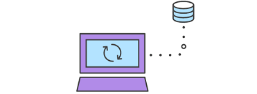

[< к содержанию](./readme.md)

## git fetch

**git fetch** извлекает и сохраняет локально из удаленного репозитория все изменения, которых пока у вас нет

Картинка [отсюда](https://www.atlassian.com/ru/git/tutorials/syncing/git-fetch) license: [CC BY 3.0](https://creativecommons.org/licenses/by/3.0/) 
